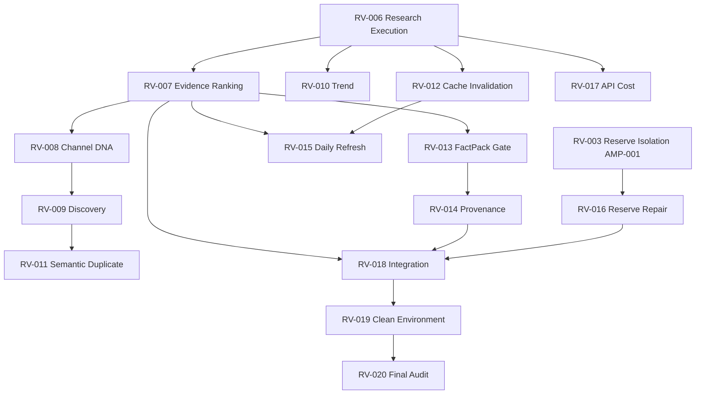

# AMP-002 Re-Verification Dependency Graph

```mermaid
flowchart TD
    RV006[RV-006 Research Execution] --> RV007[RV-007 Evidence Ranking]
    RV007 --> RV008[RV-008 Channel DNA]
    RV008 --> RV009[RV-009 Discovery]
    RV009 --> RV011[RV-011 Semantic Duplicate]
    RV006 --> RV010[RV-010 Trend]
    RV006 --> RV012[RV-012 Cache Invalidation]
    RV007 --> RV013[RV-013 FactPack Gate]
    RV013 --> RV014[RV-014 Provenance]
    RV007 --> RV015[RV-015 Daily Refresh]
    RV012 --> RV015
    RV003[RV-003 Reserve Isolation AMP-001] --> RV016[RV-016 Reserve Repair]
    RV006 --> RV017[RV-017 API Cost]
    RV007 --> RV018[RV-018 Integration]
    RV014 --> RV018
    RV016 --> RV018
    RV018 --> RV019[RV-019 Clean Environment]
    RV019 --> RV020[RV-020 Final Audit]
```

**নোট:** প্রতিটি RV task আলাদাভাবে verify — batch PASS গ্রহণযোগ্য নয়।
